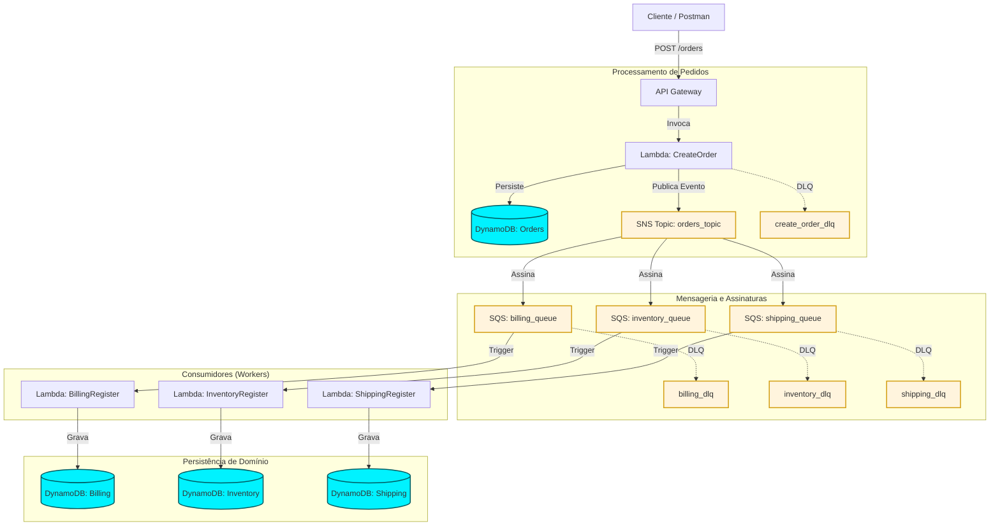

# Arquitetura do Projeto - Events

Este documento descreve a arquitetura baseada em eventos (Event-Driven Architecture) implementada na AWS utilizando Terraform.

## Diagrama de Componentes

## Descrição dos Fluxos

1.  **Ingress**: O cliente envia uma requisição POST para o **API Gateway**.
2.  **Orquestração Inicial**: A Lambda `CreateOrder` valida os dados, salva o estado inicial no DynamoDB (`Orders`) e dispara uma notificação para o tópico SNS `orders_topic`.
3.  **Fan-out**: O SNS distribui a mensagem para três filas SQS distintas (`billing`, `inventory`, `shipping`), permitindo o processamento paralelo e assíncrono.
4.  **Resiliência**: O sistema utiliza Dead Letter Queues (DLQ) para garantir que nenhuma mensagem/evento seja perdido. A Lambda `CreateOrder` redireciona erros de processamento críticos para sua própria DLQ, enquanto cada fila de domínio (`billing`, `inventory`, `shipping`) possui sua própria DLQ para capturar falhas após 3 tentativas.
5.  **Execução em Background**: Lambdas dedicadas consomem as mensagens de suas respectivas filas e atualizam as tabelas de domínio no DynamoDB.

## Tecnologias Utilizadas

- **IaaS**: Terraform
- **Compute**: AWS Lambda (Node.js 22.x)
- **API**: AWS API Gateway (REST)
- **Mensageria**: AWS SNS e AWS SQS
- **Banco de Dados**: AWS DynamoDB (NoSQL)
- **CI/CD**: GitHub Actions
